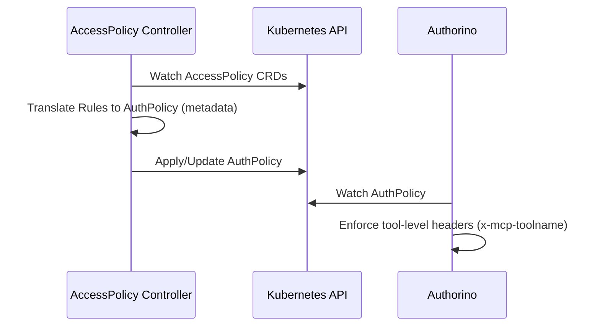

# AccessPolicy CRD Integration Strategy (mcp-gateway)

**Objective:** Design and implement a robust reconciliation loop for the `AccessPolicy` CRD to enable fine-grained tool-level authorization in the Kuadrant MCP Gateway.

## 1. Problem Analysis
The core challenge is transitioning from coarse-grained `AuthPolicy/Authorino` authentication to fine-grained tool-level authorization without creating a performance bottleneck in the `ext-proc` or `Authorino` filter chain. 

* **The Gap:** The `ext-proc` currently sets `x-mcp-*` headers. We need an intelligent controller to translate the declarative `AccessPolicy` CRD into `AuthPolicy` configurations that `Authorino` can enforce.

## 2. Proposed Architecture: The Reconciliation Loop

I propose a **Direct AuthPolicy Generation** approach for the experimental phase. This minimizes abstraction leaks and allows for rapid iteration on the reconciliation logic.

### Logical Flow

## 3. Critical Edge Cases & Implementation Challenges

To move from prototype to production-grade, I have identified the following "Hard Parts" that require careful handling:

* **Atomic Reconciliation:** We must ensure the transition from a broad `AuthPolicy` to a specific, tool-restricted `AuthPolicy` is atomic. A race condition here could inadvertently grant or deny access during the controller's reconciliation sync. I propose implementing a status-condition check to ensure the `AuthPolicy` is fully synced before allowing the MCP request flow to proceed.
* **The "Offline Gap":** `AccessPolicy` supports OIDC/ServiceAccount, but the `ext-proc` runs *before* the authz chain. I propose a validation layer in the controller that explicitly rejects malformed `AccessPolicy` rules (e.g., non-existent ServiceAccount) before they are synced to `AuthPolicy`, reducing runtime errors.
* **Tools/List Filtering:** Since `tools/list` federates from multiple upstreams, I propose implementing the filtering at the `ext-proc` response path. This ensures the client-side tool list is minimized based on the identity token's claims, preventing broker-logic pollution.

## 4. Roadmap for Implementation

| Phase | Focus | Deliverable |
| --- | --- | --- |
| **Phase 1** | CRD & Controller | Define `AccessPolicy` CRD (subset: OIDC + inline tools); implement controller scaffold to watch resources. |
| **Phase 2** | Translation | Build engine mapping `AccessPolicy` rules to `AuthPolicy` metadata (leveraging `x-mcp-toolname`). |
| **Phase 3** | CEL Support | Implement CEL-based expressions using `google/cel-go` integration. |
| **Phase 4** | Conformance | Run `kube-agentic-networking` conformance tests to validate against upstream specs. |
